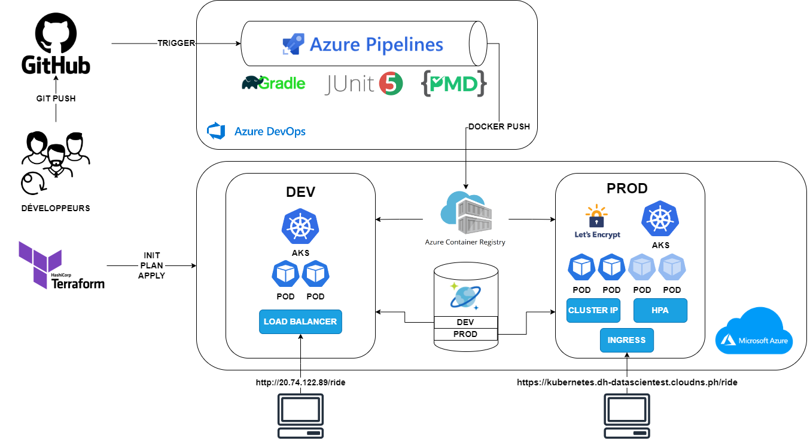
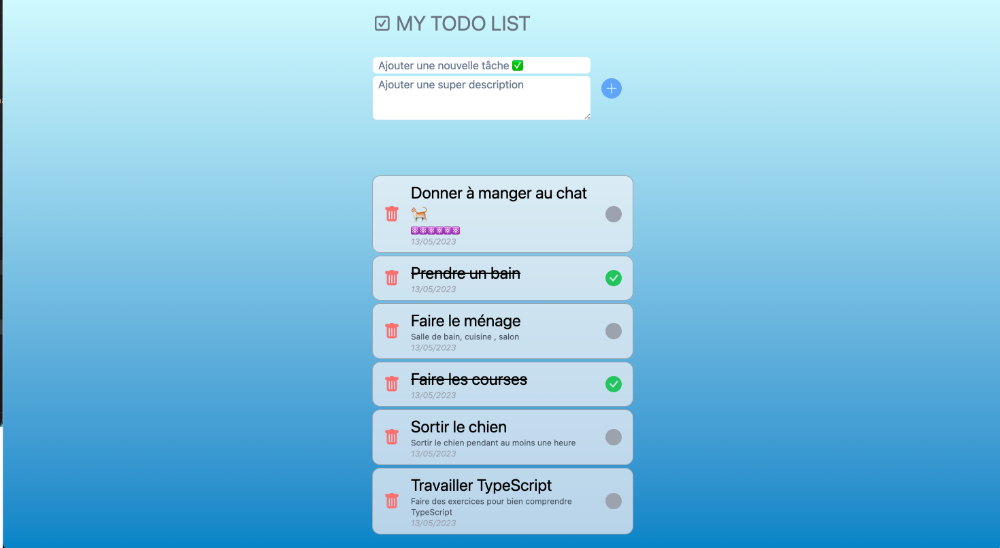
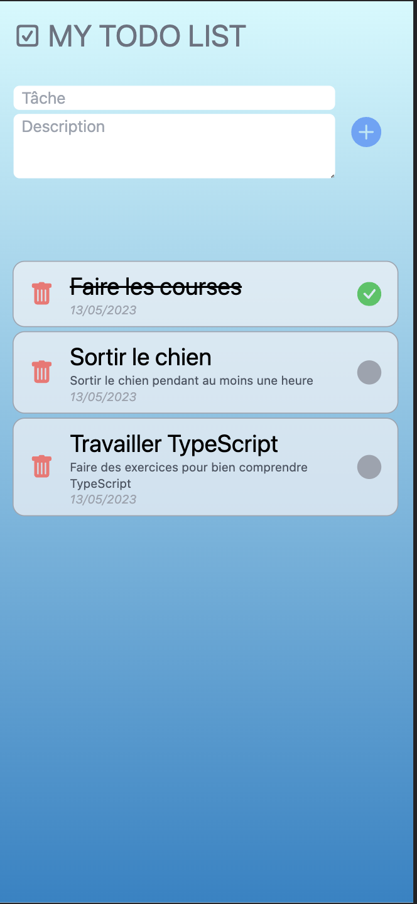
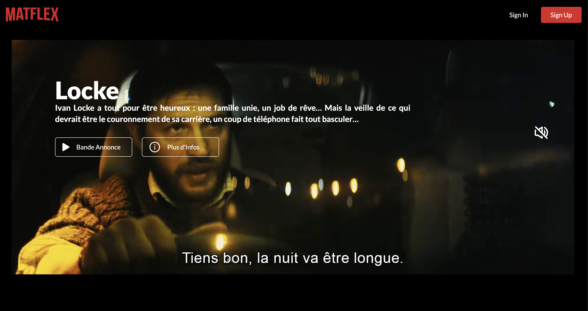
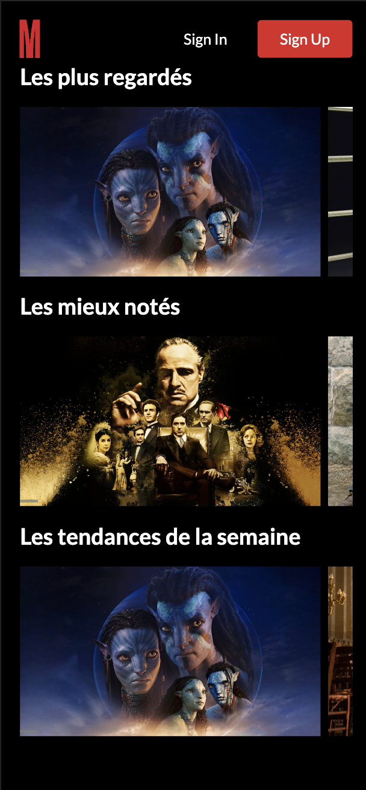
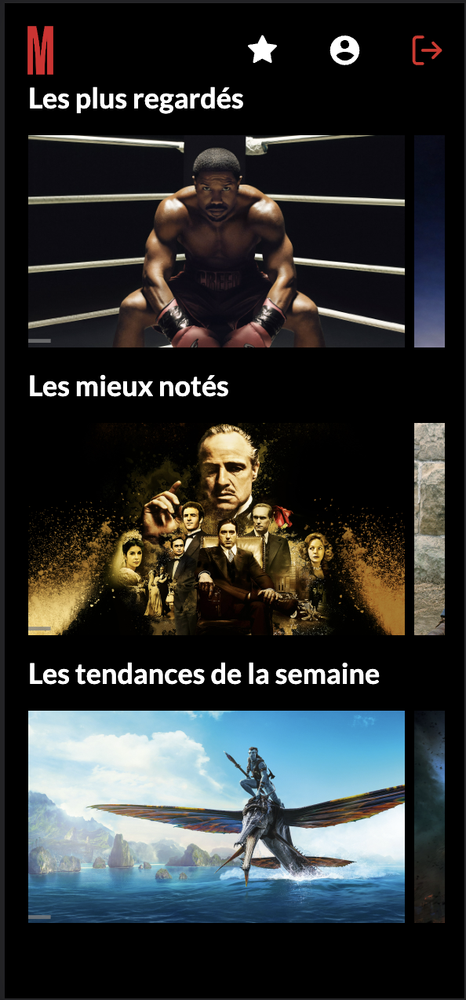
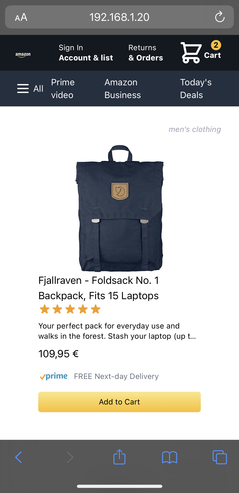
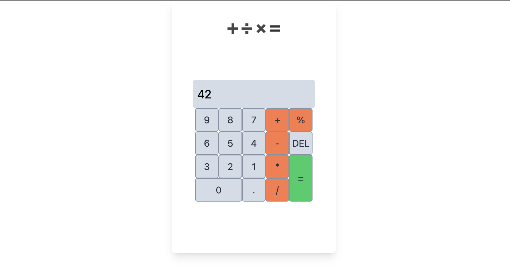

# Hi ! ⚛️

## Welcome to my Github!

My name is Mathias, I'm an apprentice developer & DevOps engineer, I know you're an apprentice all your life, but let's say I'm a novice!

> After a few years as a project manager on HR SaaS applications I decided to go to the dark side of tech.
> You will find on this gitHub the more or less successful projects by which I got my skills.

## Currently working with:

   

  
  

## Use

 

## Basics in

 

## My projects

### Theme Park - devOps project (IAC + Azure cloud + CI-CD)

[🔗](https://github.com/MathiasBerlancourt/theme-park)

### Todo List

[🔗](https://github.com/MathiasBerlancourt/todolist)

 

### Streaming App

[🔗](https://github.com/MathiasBerlancourt/streaming-app) [🌐](https://unrivaled-kitsune-6c2e79.netlify.app/)

  

### Amazon clone (work in progress ⚙️)

[🔗](https://github.com/MathiasBerlancourt/amazon-clone) [🌐](https://gleaming-gumdrop-0339b4.netlify.app/)

 

### Basic react Calculator

[🔗](https://github.com/MathiasBerlancourt/calculator)

### Skaners mobile app

[🔗](https://github.com/MathiasBerlancourt/Skaners-front)

More about SKANERS : [www.skaners.com](https://skaners.com/)

. 

### Marvel website

[🔗](https://github.com/MathiasBerlancourt/marvel-frontend) [🌐](https://silver-zabaione-ec168c.netlify.app/)

 

<!---Vinted partial clone**

Airbnb partial mobile app clone--->
