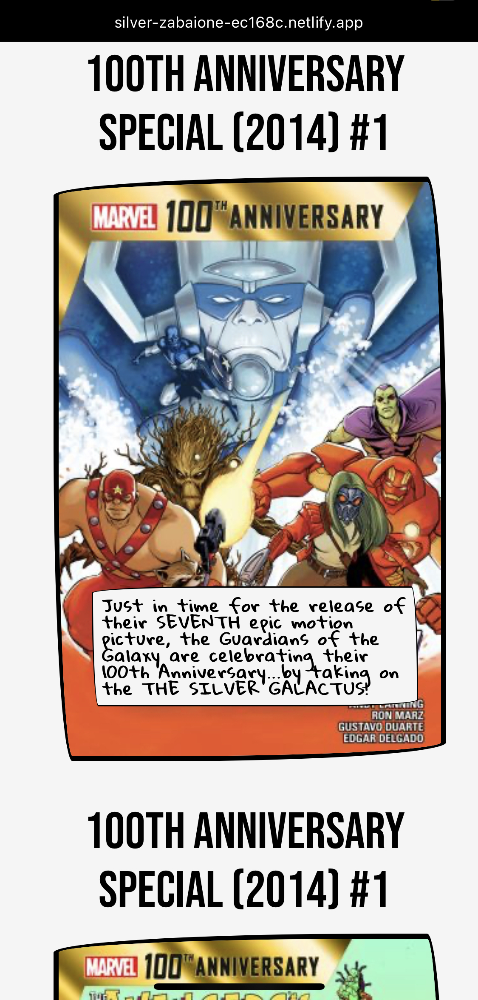

# Hello world ! ⚛️

## Welcome to my Github!

> My name is Mathias, I'm an apprentice developer, I know you're an apprentice developer all your life, but let's say I'm a novice!
> After a few years as a project manager on HR SaaS applications I decided to go to the dark side of tech.
> You will find on this repo the more or less successful projects by which I got my skills.

## Currently working with:

  

 

   

  

## Use

 

## Basics in

  

### My Resume ==> [🔗](./assets/resume.md)

## My projects

### Amazon clone

### Skaners mobile app 

.   

### Marvel website

 

<!---Vinted partial clone**

Airbnb partial mobile app clone--->

